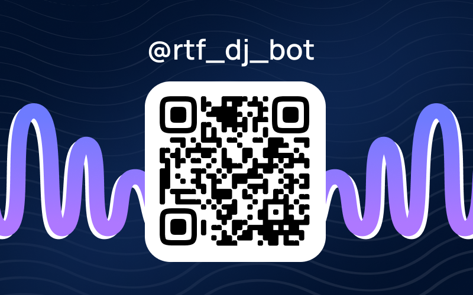
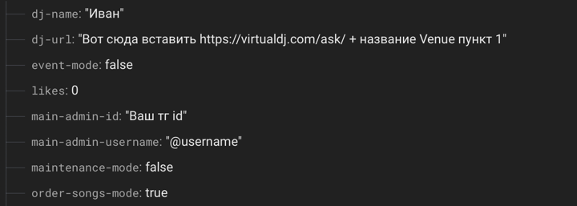

## Телеграм-бот для работы с Virtual DJ

### v. 3.3

Бот был создан для отправки запроса пользователей в Virtual DJ,
используя библиотеки `requests`, `aiogram` и `flask`
А также для лучшей функциональность используется:
`Google Realtime DB`

#### Установка

1. VDJ ask

Зарегистрироваться, перейти https://virtualdj.com/ask/setup.html и создать "Venue"

2. Firebase

Создать Realtime Database

Проверить Rules, чтобы read/write были true

Создать некоторые данные в бд:

Чуть выше скопировать ссылку БД в .env 

В разделе Project Settings > Service Accounts > Generate Private Key > сохранить в Render позже

3. Render.com Deploy

Регистрируемся через GitHub и деплоим форк этого репозитория

start command: python3 app.py

Вставляем все из .env.example все заполняем 

Advanced > Secret Files > создаем именно botdb.json, который сохранили из Firebase 

4. UptimeRobot

Создаем аккаунт и добавляем из render.com домен только что задеплоенного бота, чтобы проверял раз в 5 минут

5. Редактируем бота под себя и пользуемся.

#### Доступные команды для обычного пользователя:

* Заказать песню
* Оставить отзыв
* Поставить лайк

#### Доступные команды для профбюро

* Заказать песню (всегда)
* Рассылка (для всех или для профбюро)

#### Доступные команды для админа

* Заказать песню (всегда)
* Рассылка (для всех или для профбюро)
* Бан
* Изменение режимов (мероприятия или заказа песен)
* Смена активного DJ
